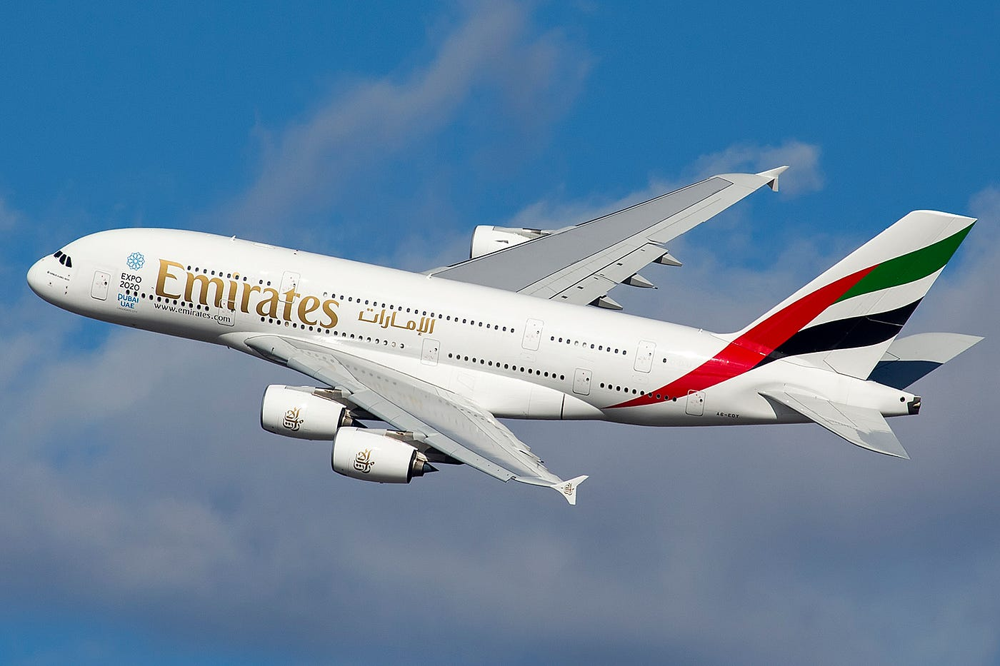
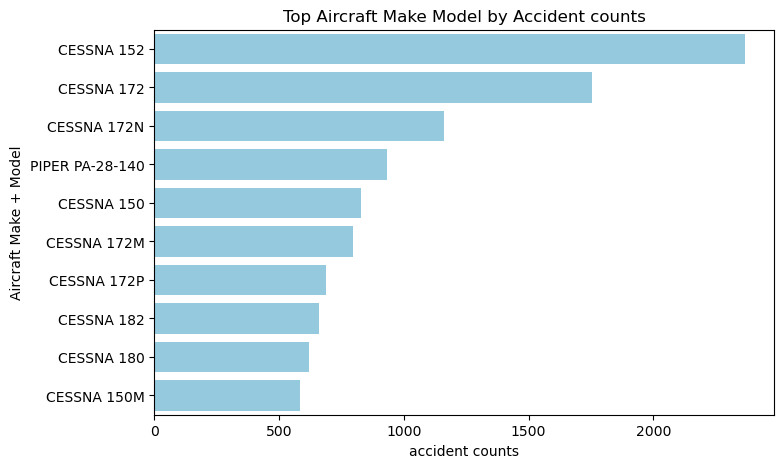
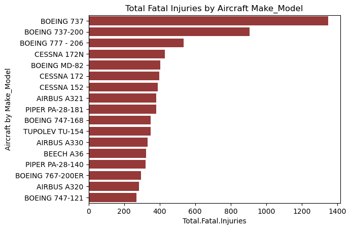
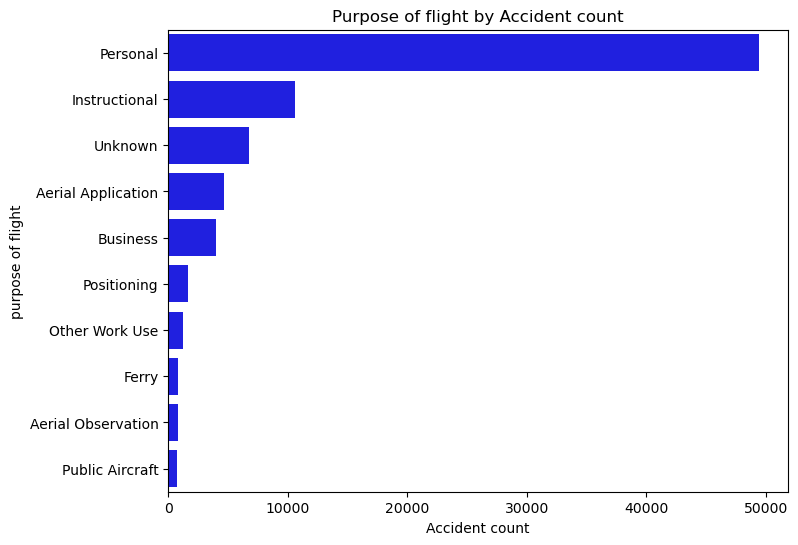
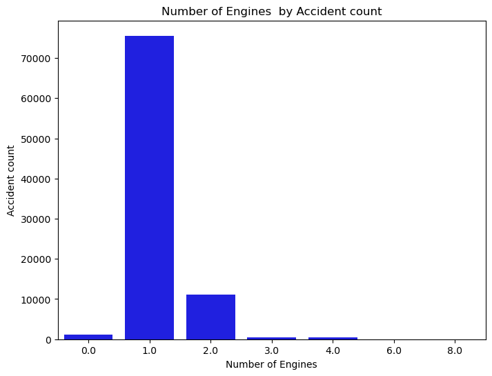

# AIRCRAFT RISK ANALYSIS
***

## OVERVIEW
This project analyzes aviation accidents from the National Transportation Safety Board(NTSB)[Data](https://www.kaggle.com/datasets/khsamaha/aviation-accident-database-synopses), covering incidents from 1962 to 2023. The goal is to identify low risk aircrafts that the company can consider for purchase as it ventures into commercial and private enterprise by cleaning, sorting, grouping, aggregatting data, we extract insight for strategic decision making of aircraft acquisiotion.

## BUSINESS PROBLEM
The company is entering the aviation industry. However, they lack insight into the historical safety performance of different aircraft. The goal of this analysis is to identify aircrafts with low accidents, considering the given factors and provide recommendations on the safest and suitable aircrafts.

## DATA
The dataset comes from National Transportation Safety Board(NTSB) and contains aviation accidents from 1962 to 2023. the dataset contain information on:

1. "Event.Date": showing the date of the incident.
2. "Make", "Model": showing manufacturer and aircraft model.
3. "Injury Severity" : Fatal, Serious, minor injuries.
4. "Total Fatal Injuries", 'Total Serious Injuries', 'Total Minor Injuries', 'Total Uninjered'
5. "Purpose of flight": Purpose such as business, personal
6. "Weather condition": Representing the Instrument and Visual Meteorogical Conditions(IMC,VMC)
7. "Broad phase of flight" : such as Takeoff, cruise, landing...
8. "Aircraft damage": extent of damage of the the aircraft
9. "Engine Type",
10. "Number of Engines": showing how many engines each aircraft had

## METHODS
This project uses descriptive analysis and predictions to show insight on aircraft risk

## RESULTS
* From my first Data analysis of aircraft Model by the number of incidents, I figured that Cessna 152 model have the highest number of accident counts
followed by Cessna 172 then Cessna 172N model.Considering Piper, model PA-28-140 have the leading accident counts.

* Comparing the Fatality rate agaist Make-Model, I figured that Boeing 737 model have the highest fatality rate, followed by Boeing 737-200 model.

* Personal flights displayed the highest accident counts than Commercial airplanes.

* Aircrafts with 1 number of engine showed the highest accident counts

## Link to Tableu dashboard
* Tableu dashboard [View the dashboard](https://public.tableau.com/app/profile/meshack.mboya/viz/AviationAccidentsDataAnalysis_17511174111600/AicraftAccidentsAnalysis)

## CONCLUSIONS
* Comparing the Fatality rate by Make and Model, Boeing 737 model showed the highest fatality rate. Boeing aircrafts are larger in size and are most commonly used for commercial services, they carry a lot more passengers compared to other aircrafts like Cessna, Piper, Beech. This increases its mortality rate with few accident counts.

* Purpose of flight. personal flights reported the highest accident counts. One good example of personal flights is Cessna 152 which displayed highest accident counts with reduced fatality rate, reason of reduced fatality is simply because they carry fewer passengers compared to commercial aiplanes.

* Number of engine. aircrafts with multi-engines showed low accident counts compared to aircrafts with 1 engine, projecting the ability of an aircraft to continue flying after failure of one engine.

## RECOMMENDATIONS
1. The company should invest in aircrafts with multi-engines i.e 2,3 engines as they show reduced accident rate from the analysis
2. For commercial airlines the company should take note of Boeing 737, 737-200 models high fatality rate and prefer other Boeing models like 767 model 
3. For personal airplanes the company should take note of Cessna 152 model highest accident counts and go with other models like Cessna 182, 150 that display reduced accident counts.